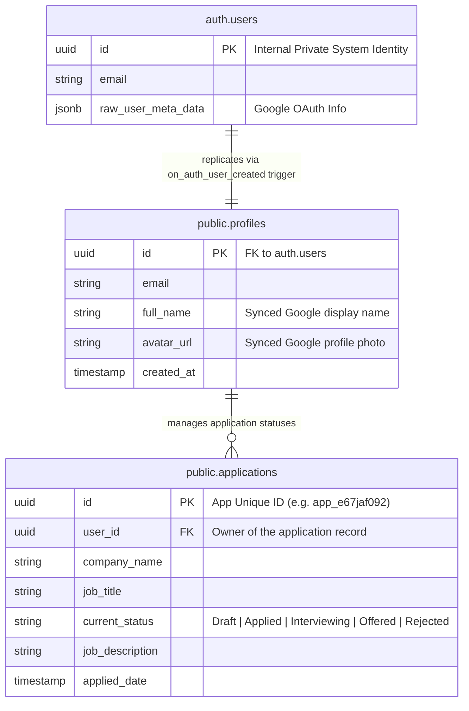

# 🎯 Applywise — Unified AI Job Application Tracker & Resume Analyzer

Applywise is a high-fidelity, unified job application tracker, ATS resume scorer, and AI-powered optimization engine. Built on a modern tech stack utilizing Next.js 16, Supabase SSR, and a resilient multi-model AI routing layer, it offers users a beautiful glassmorphic experience to streamline their job search, manage application statuses, and optimize their resumes against raw job descriptions.

---

## 🏛️ Principal-Level Architecture Guide

### 1. The Core Architectural Insight
The critical engineering accomplishment of Applywise is the coordination of a **Server-Side Rendered (SSR) Client/Server Auth Boundary** with a **Fault-Tolerant, Dynamic Multi-Model AI Routing Engine**. 

* **The Routing Gatekeeper**: Instead of using traditional middleware that can collide with compilation processes in Turbopack, Applywise uses an interceptor pattern in [proxy.ts](src/proxy.ts) combined with a hard browser cookie-sweep on the client. This solves the persistent Next.js cache issue where client logouts fail to clear server-side session headers.
* **Resilient Dual-Engine AI Analyser**: In [aiService.ts](src/services/aiService.ts), rather than relying on a single third-party model (which introduces single points of failure), the application utilizes a tiered hierarchical fallback architecture: **Grok-2** ➡️ **Gemini-2.5-Flash** ➡️ **Local Static Heuristic Engine**. This guarantees that the user gets a functional score even during complete cloud API outages or if API tokens are omitted.

Here is a clean Python translation representing this core server-side request verification and AI fallback topology:

```python
# Reference translation representing the TypeScript implementation in src/proxy.ts and src/services/aiService.ts
import logging
from typing import Dict, Optional, List

logger = logging.getLogger("ApplywiseCore")

class ServerRequestContext:
    def __init__(self, cookies: Dict[str, str], path: str):
        self.cookies = cookies
        self.path = path

class DatabaseUser:
    def __init__(self, user_id: str, email: str):
        self.user_id = user_id
        self.email = email

class AuthProxy:
    """
    Server-side proxy guarding private boundaries (Dashboard, Analyzer, Analytics).
    Equivalent to TypeScript proxy.ts:L35-58.
    """
    def __init__(self, supabase_client):
        self.supabase = supabase_client
        self.guarded_prefixes = ["/dashboard", "/analyzer", "/analytics", "/application"]

    async def intercept_request(self, context: ServerRequestContext) -> Optional[str]:
        # Sweep cookies to evaluate session authorization
        token = next((v for k, v in context.cookies.items() if k.startswith("sb-")), None)
        
        is_private = any(context.path.startswith(prefix) for prefix in self.guarded_prefixes)
        if not is_private:
            return None # Pass-through to public page
            
        if not token:
            return "/auth" # Redirect immediately to secure sign-in page
            
        try:
            user = await self.supabase.get_user(token)
            if not user:
                return "/auth"
        except Exception:
            return "/auth"
            
        return None # Authorized access

class ResumeAnalysisEngine:
    """
    Multi-model robust analyzer utilizing hierarchical fallback gates.
    Equivalent to TypeScript src/services/aiService.ts:L171-204.
    """
    def __init__(self, grok_key: Optional[str], gemini_key: Optional[str]):
        self.grok_key = grok_key
        self.gemini_key = gemini_key

    async def analyze(self, resume_text: str, jd_text: Optional[str] = "") -> Dict:
        # Gate 1: Check and attempt Grok 2 analysis
        if self.grok_key:
            try:
                logger.info("Attempting analysis using Grok-2 engine...")
                return await self._grok_call(resume_text, jd_text)
            except Exception as e:
                logger.warning(f"Grok-2 failed: {e}. Falling back to Gemini...")

        # Gate 2: Fall back to Google Gemini-2.5-Flash
        if self.gemini_key:
            try:
                logger.info("Attempting analysis using Gemini-2.5-Flash engine...")
                return await self._gemini_call(resume_text, jd_text)
            except Exception as e:
                logger.warning(f"Gemini-2.5-Flash failed: {e}. Falling back to Local Heuristics...")

        # Gate 3: Core local heuristics guarantee (Zero API Calls)
        logger.info("No cloud credentials configured or APIs offline. Falling back to local engine.")
        return self._local_heuristic_analysis(resume_text, jd_text)

    async def _grok_call(self, resume: str, jd: str) -> Dict:
        # Underlying HTTP post payload parsing...
        return {"matchScore": 85, "provider": "Grok"}

    async def _gemini_call(self, resume: str, jd: str) -> Dict:
        # Underlying HTTP post payload parsing...
        return {"matchScore": 82, "provider": "Gemini"}

    def _local_heuristic_analysis(self, resume: str, jd: str) -> Dict:
        return {"matchScore": 70, "provider": "Local Heuristics"}
```

---

### 2. System Topology
The following diagrams illustrate the flow of data between client operations, secure routing intercepts, and backend databases.

```mermaid
graph TD
    Client[Browser UI / Extension] -->|Auth/Data Requests| Proxy[Next.js Server Interceptor src/proxy.ts]
    Proxy -->|Unauthenticated / Cookie Null| AuthPage[/auth Route]
    Proxy -->|Authenticated| SSR[App Router Server Components]
    SSR -->|Fetch Profile & Statuses| PostgREST[(Supabase Database Engine)]
    SSR -->|Token Sync Callback| AuthTrigger[auth.users Trigger]
    AuthTrigger -->|Automatically Replicates| ProfileDB[(public.profiles Table)]
    
    Client -->|Upload PDF Resume| Extractor[pdf.js Parser client-side]
    Extractor -->|Raw Text| AIService[aiService.ts Direct Controller]
    AIService -->|Gate 1: Grok Key Present| GrokAPI[X.AI chat/completions grok-2]
    AIService -->|Gate 2: Gemini Key Present| GeminiAPI[Google generativelanguage gemini-2.5-flash]
    AIService -->|Gate 3: All Keys Missing| Heuristics[Local Regex Keyword Engine]
```

### 3. Domain Model Schema


---

### 4. Critical Engineering Tradeoffs

| Strategic Decision | Benefit | Tradeoff |
| :--- | :--- | :--- |
| **Next.js 16 Interceptor vs Middleware** | Resolves Turbopack single-gateway routing collisions and guarantees compatibility with Turbopack fast builds. | Requires manual server-side auth checking hooks (`supabase.auth.getUser()`) inside each server component layer. |
| **Client-Side Cookie Cleansing on Sign-Out** | Solves the infamous "Session Sticking" bug where Server-Side Next.js caches private dashboard headers even after calling `.signOut()`. | Demands a small script hook inside [Topbar.tsx](src/components/Topbar.tsx) to query and purge client browser cookies starting with `sb-`. |
| **Idempotent Postgres Synchronization Triggers** | Ensures absolute database synchronization by automatically translating new OAuth users into public profiles. | Requires the database manager to run the trigger script once inside the Supabase console dashboard. |
| **Dual-Engine AI Fallback Routing** | Guarantees system uptime, high ATS-scoring capabilities, and graceful failover if a particular cloud model is restricted or offline. | Increments visual configuration checks and API handling branches within the services directory. |

---

## 🚀 Zero-to-Hero Onboarding Guide

### Part I: Next.js 16 & Supabase SSR Boundaries
Unlike traditional Python MVC patterns (like Django or FastAPI) where sessions are checked via server-side session databases or stateless JWT middleware, Next.js 16 leverages a **Hybrid SSR boundary**:
1. **Server Components (`layout.tsx`, `page.tsx`)**: Run exclusively on the Node.js server. They do not have access to client-side state, local storage, or window context. They read headers, parameters, and inject cookies to authenticate through the Supabase SSR wrapper in [server.ts](src/lib/supabase/server.ts).
2. **Client Components (marked with `'use client'`)**: Run inside the client browser. They coordinate user interactions (like uploading files or clicking logout) and communicate via the client-side Supabase wrapper in [client.ts](src/lib/supabase/client.ts).

### Part II: Codebase Layout
Navigating our directories is straightforward:
```bash
applywise/
├── public/                 # Static graphical elements, standard typography assets
├── src/
│   ├── app/                # Server-Side Routing Gateways (Next.js App Router)
│   │   ├── actions/        # Server Actions (database manipulations and session checks)
│   │   ├── analytics/      # Analytics visuals and aggregation panel
│   │   ├── analyzer/       # Resume Parser and ATS score display screen
│   │   ├── api/            # Serverless microservices (CRUD actions for applications)
│   │   ├── auth/           # OAuth logins, redirects, and social integrations
│   │   ├── dashboard/      # Primary tracker interface and dynamic bento grid
│   │   └── application/    # Application specific detail viewer and state updates
│   ├── components/         # Reusable styling widgets (Topbar, Navbar, StatusUpdater)
│   ├── hooks/              # Custom React state hooks (e.g. user session monitoring)
│   ├── lib/                # Database orchestration, Supabase client declarations
│   └── services/           # Heavy business operations (Multi-Model AI optimization engine)
└── postcss.config.mjs      # Tailwind and CSS customization configs
```

### Part III: Getting Setup

#### 1. Configure the Environment
Ensure your local `.env.local` contains the following active credentials:
```env
NEXT_PUBLIC_SUPABASE_URL=your_supabase_project_url
NEXT_PUBLIC_SUPABASE_ANON_KEY=your_supabase_anon_key
NEXT_PUBLIC_GEMINI_API_KEY=your_gemini_api_key   # Optional Fallback
NEXT_PUBLIC_GROK_KEY=your_grok_api_key           # Primary AI Engine
```

#### 2. Establish Database Synchronizations (The One-Time Trigger)
Run this idempotent SQL script in your **[Supabase SQL Editor](https://supabase.com/dashboard)**. This will automatically sync every new Google OAuth login directly into your `public.profiles` database:
```sql
-- Create a public profiles table to hold synced user profiles
create table if not exists public.profiles (
  id uuid references auth.users on delete cascade primary key,
  email text,
  full_name text,
  avatar_url text,
  created_at timestamp with time zone default timezone('utc'::text, now()) not null,
  updated_at timestamp with time zone default timezone('utc'::text, now()) not null
);

-- Enable RLS and setup safe policies
alter table public.profiles enable row level security;
drop policy if exists "Allow public read access to profiles" on public.profiles;
create policy "Allow public read access to profiles" on public.profiles for select using (true);
drop policy if exists "Allow users to update their own profile" on public.profiles;
create policy "Allow users to update their own profile" on public.profiles for update using (auth.uid() = id);

-- Create a Postgres Trigger Function to extract metadata automatically
create or replace function public.handle_new_user()
returns trigger as $$
begin
  insert into public.profiles (id, email, full_name, avatar_url)
  values (
    new.id,
    new.email,
    coalesce(new.raw_user_meta_data->>'full_name', new.raw_user_meta_data->>'name'),
    new.raw_user_meta_data->>'avatar_url'
  )
  on conflict (id) do update
  set
    email = excluded.email,
    full_name = excluded.full_name,
    avatar_url = excluded.avatar_url,
    updated_at = now();
  return new;
end;
$$ language plpgsql security definer;

-- Attach the trigger to the auth.users table
drop trigger if exists on_auth_user_created on auth.users;
create trigger on_auth_user_created
  after insert on auth.users
  for each row execute procedure public.handle_new_user();
```

#### 3. Run the Development Server
```bash
npm install
npm run dev
```
Open [http://localhost:3000](http://localhost:3000) (or the production hosted dashboard at [https://house-of-edtech-one.vercel.app](https://house-of-edtech-one.vercel.app)) to access the premium glassmorphic dashboard!

#### 4. Load the Chrome Extension (Job IQ Scraper)
To leverage the automated job scraping and quick-save features across LinkedIn, Indeed, Naukri, Hirist, and Glassdoor:
1. Open Google Chrome (or any Chromium-based browser like Brave, Edge, or Opera).
2. Enter `chrome://extensions/` in your browser URL bar.
3. Toggle the **Developer mode** switch in the top-right corner to **ON**.
4. Click the **Load unpacked** button in the top-left corner of the page.
5. Select the **`extension/`** directory located at the root of this project workspace.
6. The **Applywise Job IQ Scraper** is now fully active! Pin it from your extensions menu to quickly parse listings and automatically synchronize them with your active dashboard (now default configured to sync with the production site at `https://house-of-edtech-one.vercel.app`).

### Part IV: Comprehensive Testing Suite

Applywise features a dual-layer professional testing suite to guarantee execution correctness and stability:

1. **Unit Testing (Jest & React Testing Library)**:
   * Validates individual components, state updates, and helper methods.
   * Run the unit tests:
     ```bash
     npm run test
     ```
   * Jest is optimized with isolated ignore patterns (`e2e/`, `.next/`) to complete runs in under ~3 seconds.

2. **End-to-End (E2E) Testing (Playwright)**:
   * Simulates real-user browser flows, rendering the application in actual headless Chrome to verify UI assembly, topbar navigation, active link highlights, and cookie sessions.
   * Run E2E tests:
     ```bash
     npm run e2e
     ```

### Part V: Brand & Layout Consistency Updates

To deliver a polished, distraction-free premium experience:
* **Unified Global Sticky Footer**: Consolidated manual page footers into a single, beautifully styled dynamic component. Includes credits to `Built by Nidhin` linking directly to:
  * **GitHub**: [NidhinSimon](https://github.com/NidhinSimon)
  * **LinkedIn**: [NidhinSimon](https://www.linkedin.com/in/nidhinsimon/)
* **Logo Navigation Links**: Both the main homepage `Navbar` brand logo and the `Auth` login card logo are interactive links that redirect to `/`.
* **Sleek Minimal Navbar**: Removed pricing section links from the top navbar to keep the focus clean, premium, and centered around tracking & analytics power-features.

---

## 🗺️ Key Core File Navigation Directory

Below is a detailed map highlighting the core operational logic inside Applywise:

### ⚙️ Database & Session Core
* 🔌 **[src/lib/supabase/client.ts](src/lib/supabase/client.ts#L1-L10)**: Initializes the browser-safe client for client components.
* 🔌 **[src/lib/supabase/server.ts](src/lib/supabase/server.ts#L1-L25)**: Spawns server-safe cookies-aware context for server components.
* 🛡️ **[src/proxy.ts](src/proxy.ts#L35-L58)**: Core security interceptor validating sessions prior to server-side page renders.
* ⚡ **[src/app/auth/callback/route.ts](src/app/auth/callback/route.ts#L13-L52)**: Manages code exchanges for Google OAuth callbacks and upserts profile details directly.

### 💼 Application Business Operations
* 🛠️ **[src/lib/applications.ts](src/lib/applications.ts#L121-L233)**: Core PostgREST interactions managing CRUD entries, status updates, and stats loaders.
* 🤖 **[src/services/aiService.ts](src/services/aiService.ts#L171-L204)**: Unified multi-model routing engine mapping analysis tasks from Grok-2 to Gemini-2.5-Flash.

### 🎨 Visual Controllers
* 🧭 **[src/components/Topbar.tsx](src/components/Topbar.tsx#L61-L82)**: Coordinates profile menus, header states, and cookie purging client-side.
* 🔄 **[src/components/StatusUpdater.tsx](src/components/StatusUpdater.tsx#L50-L110)**: Triggers modal overlays enabling instant status changes and tracking operations.

---

## 📖 Complete Glossary of Project Terminology

1. **ATS (Applicant Tracking System)**: Automated HR screening engines evaluating keyword matches and structuring formats on incoming resumes.
2. **RLS (Row Level Security)**: Postgres policy layer restricting read/write permissions directly on database rows based on the caller's session UID.
3. **Turbopack**: Next.js 16's rust-powered, high-speed bundler designed for extremely quick local development loads.
4. **SSR (Server Side Rendering)**: Pre-rendering user layout structures on the server before transmitting finished HTML documents to browser environments.
5. **PostgREST**: The background framework wrapping Supabase databases, turning schema tables into safe HTTP REST API endpoints.
6. **Gemini-2.5-Flash**: Google's high-speed, lightweight cloud LLM utilized for immediate ATS parsing operations.
7. **Grok-2**: X.AI's advanced generative model utilized as the primary engine for high-fidelity cover letters and analytical insights.
8. **Heuristic Extraction**: Algorithmic parsing based on custom regex sets and keyword mappings instead of cloud-reliant generative APIs.
9. **Single-Gateway Proxy**: The routing convention in Next.js 16 where intercept routes replace the legacy middleware.ts compilation wrapper.
10. **Cookie Sweeper**: The script logic that manually destroys cookies prefixing `sb-` on client logouts, eliminating cached cookie-session states on Next.js.
11. **Idempotence**: A properties standard where executing an operation multiple times produces the identical result without throwing errors (e.g. database schema migrations).
12. **glassmorphism**: A premium visual theme utilising backdrop-filters, subtle gradients, and high transparency to simulate frosted glass visual layouts.
13. **Bento Grid**: A visual dashboard structure arranging data indicators, charts, and tables into responsive, rectangular components.
14. **OAuth Callback Route**: The secure receiver endpoint `/auth/callback` completing the security exchange after social logins.
15. **JWT (JSON Web Token)**: A compact, URL-safe container for verifying identity payloads.
16. **Session Cache**: Local Next.js request caches preserving historical layouts, occasionally causing unauthenticated page remnants without hard sweep commands.
17. **PostgreSQL Trigger**: An automated database action executing designated procedures immediately upon inserts, updates, or deletes.
18. **security definer**: A PostgreSQL function attribute forcing it to execute under high privileges (e.g., bypassing standard client row-level security for sync tasks).
19. **raw_user_meta_data**: The structured JSON payload inside Supabase containing raw metadata passed from external social OAuth identity providers.
20. **coalesce**: A SQL evaluation operator selecting the first non-null argument among a given sequence.
21. **Optimized Experience**: AI-rewritten professional achievements quantifying structural bullet achievements instead of passive descriptions.
22. **ATS Match Score**: A scale rating from 0 to 100 assessing the keyword compatibility of a resume against a target job role.
23. **Cover Letter Generator**: An AI optimization model generating contextual letters explaining role interests and background credentials.
24. **Next.js Server Actions**: Functions declared on the server but callable directly from the client without manually managing HTTP fetching branches.
25. **CORS (Cross-Origin Resource Sharing)**: Security configurations allowing web pages to request assets from alternative domains.
26. **Node.js**: The Javascript execution framework powering backend servers and script bundling actions.
27. **TypeScript**: A strongly typed syntactic extension of Javascript, reducing compilation runtime bugs.
28. **Vercel**: The native cloud application platform designed to host Next.js 16 serverless pages.
29. **backdrop-filter**: The CSS attribute performing graphical manipulations (like blurring or contrast shifts) to areas behind a glass element.
30. **CRUD (Create, Read, Update, Delete)**: The four core operations executed against database memory registries.
31. **npm (Node Package Manager)**: The library manager installing, sharing, and running local developer tools.
32. **PostCSS**: The framework translating custom utility attributes into browser-compliant Vanilla CSS formats.
33. **UUID (Universally Unique Identifier)**: A 128-bit label standard ensuring absolute identity numbers across massive server grids.
34. **upsert**: A database command that inserts a record if it is absent or updates the existing entry on duplicate conflicts.
35. **onConflict**: The SQL condition rule determining how database upsert actions process duplicate primary key conditions.
36. **Raw Text Extractor**: PDF parsing pipelines translating raw document streams into normal character strings.
37. **Analytics Aggregate**: Charts representing visual status percentages, application counts, and tracking trends.
38. **Bypass RLS**: Running database calls through a high-privilege service-role key or security definer trigger, ignoring client limitations.
39. **State Syncing**: Keeping browser layout interfaces completely aligned with remote database records.
40. **Proxy Proxying**: Routing serverless path checks securely before rendering Next.js pages.
